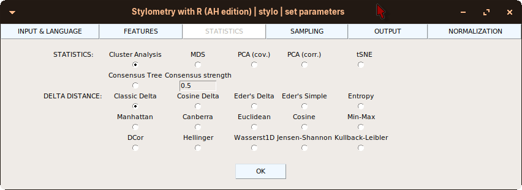

# stylo AH: R package for stylometric analyses, Ancient History

**Author:** Prof. Schubert Alte Geschichte Leipzig, H. Kahl Alte Geschichte Trier

We added a few Greek language specific normalization functions and some feature extraction methodes. We prepared a starter script, that does the install of additional packages and the start up of the stylo version. 





## Install / regular start

- Download this github repository (Code > Download ZIP).
- Save the ZIP to any writable location on you system. We assume, that you have R (and RStudio) installed.
- Unzip the archive.
- Open up the *installstartstyAH.R* in RStudio.
- Set working directory: Menu > Session > Set Working Directory > To Source File Location.
- Select all text of the script and hit run (see screenshot below).
- Or use the command line: *Rscript installstartstyAH.R*.
- The script should do the install of missing packages, the build of the stylo Ancient History Edition, the install and the execution of the stylo GUI.


To regularly start stylo with Rstudio use the script *juststartstyloAH.R*. 
- Open up the *installstartstyAH.R* in RStudio.
- Set working directory: Menu > Session > Set Working Directory > To Source File Location.
- Select all text of the script and hit run (see screenshot below).
You also may use the commandline run the script like *Rscript installstartstyAH.R* from the stylo folder.


## Version
We use the version count of the original stylo and add a fourth number, which count the AHE releases. The first release was the prove of concept. The second was the normalzation intergation, the third is the release of new features. This is Version 0.7.4.8.


## Usage: Normalization

This list gives you a notion of the normalization function behind the GUI check buttons.

**Disam. diacrit.**: Reduce the set of diacritic signs to a minimum. Replace potential wrong used signs.

**Replace diacrit.**: This removes the diacritic signs from a string.

**Exp. elisions**: Select this to expand elisions.

**Translit. Greek**: Select this to transliterate Greek to Latin letters.

**Iota sub / ad**: This converts the iota subscriptum to the iota adscriptum.

**All del**: This is a combination of every normalization steps, except the handling of hyphenation, of alpha privativum and elisions.

**Delete numbering**: This deletes numbering in a edition text, for example something like *[34]*.

**Delete ligatures**: Expansion of ligatures.

**Delete punctuation**: Removal of punctuation including high point.

**Delete unknown signs**: Some signs maybe used as marks or as editorial signs. Signs: ⁙, ☾, ☽, ⸎, #, ⋖, *, †

**Line break to space**: Turn newlines into space.

**Delete markup**: If markup remains, than this removes it.

**Eq. sigma**: The tailing sigma is replaced with the ordinary sigma.

**Delete brackets**: If brackets remain, this just deletes the signs, not the content.

**UV (Latin)**: Replace U with V.

**IJ (Latin)**: Replace J with I.

**Handle hyphenation**: Remove hyphenation!!!!!!!

**Alpha privativum**: If the alpha privativum is distinguishable, than this functions handle it.

**Del. Unterpunkte**: Replace underdots from inscription / papyri texts.

**Gravis 2 Akut**: Replace Gravis with Akut.

## USAGE: Features

This list shows the should give you a notion of the function behind the GUI configurations:

**w.l.c.**: Stylo has its way of building word-ngrams wich was fine, the way of building character-ngrams can't be configured - it is always the whole input string that turned into character-ngrams. We added the word level character ngrams, with and with out padding. Given the string ist "ll kk bb", than the word level character bigrams with padding may be "-l, ll, l-, -k, kk, k-, -b, bb, b-". Padding could be addewith the checkbutton "padding".

**no consonants**: A list of tokens, but the consonants removed from it, is used as feature array. Example: "if not so slow" gives "i o o o".

**no vovels**: A list of token, vovels removed from them, is used as feature array. Example: "if not so slow" gives "f nt s slw".

**small words**: The featrue array will consist of small words. Think of them as the opposite to verbe and noun.

**big words**: The feature array will consist of big words, that means verbs and nouns.

**head body coda**: Every word is evenly devided into a head, body and a tail. Example: "perfect" gives "pe rf ect".

**all partitions**: Every token is splited into all possible permutations öletters distributed over head, body and tail. Example: "man" "m a n, ma n -, m an -".

**SMWPA**: This is a pattern generater, the patterns consit of stopwords and a encoding of gaps between them. The pattern is taken as token in the following process. 

## USAGE: Distance messure (STATISTICS)

**DCor**: A messure derived from the bona fide vector correlation called distance correlation. We use the R implementation from the energy R package. This implemenation is a little slow. Working on a own implementation / using C implementation.

**Hillinger**: Use Hillinger distance computation.

**Wasserst1D**: Use Wasserstein transport implementation as distance computation.

**Jenson-Shannon**: Use Jenson Shannon divergence as "distance" computation.

**Kullback-Leibler**: Use Kullback-Leibler divergence implementation as distance computation.


## USAGE: OUTPUT

**Vergleich**: Do save a plot of the vector of propabilities of text 1 versus all other text vectors. And a plot of the all possible distances between text 1 and all other texts.

# stylo: R package for stylometric analyses

**Authors:** Maciej Eder<sup>*</sup>, Mike Kestemont, Jan Rybicki, Steffen Pielström<br/>
**License:** [GPL-3](https://opensource.org/licenses/GPL-3.0)


[](https://CRAN.R-project.org/package=stylo) [](https://travis-ci.org/computationalstylistics/stylo) [](https://www.rpackages.io/package/stylo) 


This package provides a number of functions, supplemented by a GUI, to perform various
analyses in the field of computational stylistics, authorship attribution, etc.

Refer to the [Computational Stylistics Group webpage](https://computationalstylistics.github.io/), especially the subpage [Projects](https://computationalstylistics.github.io/projects/), to get some ideas about possible applications of the package `stylo`.


## Citation

If you find the package `stylo` useful and plan to publish your results, please consider citing the following paper:

**Eder, M., Rybicki, J. and Kestemont, M.** (2016). Stylometry with R: a package for computational text analysis. _R Journal_, 8(1): 107-21.  [https://journal.r-project.org/archive/2016/RJ-2016-007/index.html](https://journal.r-project.org/archive/2016/RJ-2016-007/index.html)


## Installation

There are four ways of installing `stylo`:

1. from CRAN repository
2. from the GitHub repository, via the package `devtools`
3. from a locally downloaded file
4. building the package directly from source files


###  1. Installing from CRAN repository

This is the simplest way to install `stylo` (as well as any other R package). Launch R, make sure you are connected to the internet, type: 

```
install.packages("stylo")
```

choose your favorite CRAN mirror (a window will usually pop up), click OK.

If you are a MacOS user, please have a look below, at the **Installation issues** section.


### 2. Installing from the GitHub repository

A convenient way to install R packages directly from the GitHub repository is to use the package `devtools`. Unless you have already installed it, you should do it now:

```install.packages("devtools")```

Then, install the package `stylo`:

```
library(devtools)
install_github("computationalstylistics/stylo")
```

The remarks about possible issues on MacOS apply are valid also in this case.


### 3. Installing from a local file

This is an option for more advanced users. You need to obtain a so-called tarball file, which is a compressed version of the package (you can grab it from CRAN). It might be named `stylo_0.6.9.tar.gz`, depending of the current version of course. Then type in R console:

```
setwd("I/hope/I/can/remember/where/I/have/put/the/zipfile/")
install.packages("stylo_0.7.1.tar.gz", repos = NULL, type = "source")
```


### 4. Building a package from source files

This is something for real geeks. Clone this very repository, unpack it, and type the following lines at the command prompt:

```
R CMD build stylo
R CMD INSTALL stylo
```


## Installation issues


**NOTE** (Mac OS users): the package `stylo` requires X11 support being installed. To quote "R for Mac OS X FAQ" (http://cran.r-project.org/bin/macosx/RMacOSX-FAQ.html): “Each binary distribution of R available through CRAN is build to use the X11 implementation of Tcl/Tk. Of course a X windows server has to be started first: this should happen automatically on OS X, provided it has been installed (it needs a separate install on Mountain Lion or later). The first time things are done in the X server there can be a long delay whilst a font cache is constructed; starting the server can take several seconds.”

You might also run into encoding errors when you start up R (e.g. “WARNING: You're using a non-UTF8 locale” etc.). In that case, you should close R, open a new window in Applications > Terminal and execute the following line:

```
defaults write org.R-project.R force.LANG en_US.UTF-8
```

Next, close the Terminal and start up R again.

**ANOTHER NOTE** A slightly different workaround of the above problem (Mac users again):

* Install XQuartz, restart Mac
* Open Terminal, type: `sudo ln -s /opt/X11 /usr/X11`
* Run XQuartz
* Run R, type: `system('defaults write org.R-project.R force.LANG en_US.UTF-8')`


**YET ANOTHER NOTE** On MacOS Mojave one usually faces the problem of not properly recognized tcltk support. Open your terminal and type the following command:

`xcode-select --install`

This will download and install xcode developer tools and fix the problem. The problem is that one needs to explicitly agree to the license agreement.


## Usage

This section is meant to give the users a general outline of what the package can do, rather than providing a comprehensive description of designing a stylometric test using the R package `stylo`. Refer to the following documents:

* for (real) beginners: a crush introduction in the form of a [slideshow](https://computationalstylistics.github.io/stylo_nutshell/)
* for (sort of) beginners: a concise [HOWTO](https://github.com/computationalstylistics/stylo_howto/blob/master/stylo_howto.pdf)
* for advanced users: a paper in [R Journal](https://journal.r-project.org/archive/2016/RJ-2016-007/RJ-2016-007.pdf)
* full documentation at [CRAN](https://cran.r-project.org/web/packages/stylo/stylo.pdf)


## Materials on Youtube

* [Introduction to the package ‘stylo’: first steps](https://www.youtube.com/watch?v=pWOCfZnitdc&t=6s)
* [Introduction to the package ‘stylo’: installation](https://www.youtube.com/watch?v=Rv7u4UNZJrA&t=86s)
* [Introduction to the package ‘stylo’: basic parameters](https://www.youtube.com/watch?v=uPHPhIo2Drc)


## Docs on non-obvious functionalities


* [Authorship verification with the package 'stylo'](https://computationalstylistics.github.io/blog/imposters)
* [Cross-validation using the function `classify()`](https://computationalstylistics.github.io/blog/cross-validation)
* [Custom distance measures](https://computationalstylistics.github.io/blog/custom_distances)
* [Testing rolling stylometry](https://computationalstylistics.github.io/blog/rolling_stylometry)
* [Using ‘Stylo’ with languages other than English](https://computationalstylistics.github.io/blog/stylo_and_languages/)


## Other relevant resources


* Despite a black legend, R and Python are not necessarily in a deadly clash: here is [a great post](https://cligs.hypotheses.org/577) by José Calvo Tello on invoking the package `stylo` directly from Python!

* Using the package `stylo` with the TXM environment: see [this post](https://groupes.renater.fr/wiki/txm-users/public/tutorial_to_use_stylo_into_txm) by Serge Heiden.

* Probably not a  bad idea to check a comprehensive [Stylometry Bibliography](https://www.zotero.org/groups/643516/stylometry_bibliography) curated by Christof Schöch, before starting an experiment in text analysis.

* The package `stylo` has been created as a by-product of a few projects conducted by the Computational Stylistics Group. See [this website](https://computationalstylistics.github.io/) for further details. An [older version](https://sites.google.com/site/computationalstylistics/) of the webpage is also there, even if it has not been be updated for a while.

 
